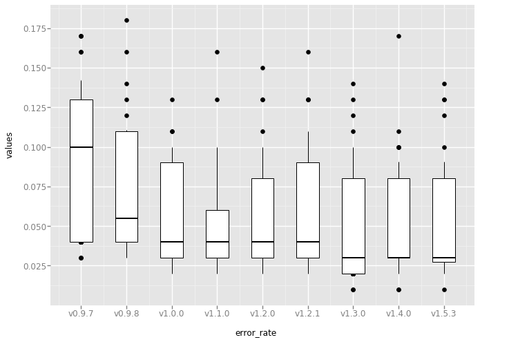

In this document the `${MATAM_DIR}` is the location of your clone of MATAM.

```
DATABASE_DIR=${MATAM_DIR}/db
DATASET_DIR=${MATAM_DIR}/example/16sp_simulated_dataset
EVAL_AND_RELEASE_DIR=${MATAM_DIR}/eval_and_release
TEST_DOCKER_DIR=${EVAL_AND_RELEASE_DIR}/test_docker
```

# Prerequisites

Follow the procedure to install MATAM from the sources.
Then install some more packages:
`(matam)$ conda install -y rpy2 jupyter pandas matplotlib ggplot imagemagick`

The SILVA DB is needed:
`(matam)$ index_default_ssu_rrna_db.py -d ${MATAM_DIR}/db --max_memory 10000`

Install [docker](https://docs.docker.com/install/)
# A - Test MATAM

## 1 - Run pytest -- quick test to see if nothing too obvious is broken

WARNING: The coverage of the code by the tests is really low.
Moreover the functional test based on quast has loose threshold. For exemple, the test will be a success when the error_rate < 0.15.

```bash
(matam)$ cd ${MATAM_DIR} && python -m pytest -rsx
```

## 2 - Run MATAM 100x

MATAM is not deterministic, so we can observe little differences each time we run MATAM.

You can try to catch this diversity with the following scripts
```bash
(matam)$ cd ${EVAL_AND_RELEASE_DIR}/test_matam && bash -i run_matam_multiple_times_releases.sh . TAG
```
where TAG can be develop, master, v1.6.0 or even a commit number

It will create an output dir wit the name of TAG and put the 100 matam.log in this directory.

A script is available to be able to compared the results between different version of MATAM:

```bash
#go in the test_matam directory & run jupyter
(matam)$ cd ${EVAL_AND_RELEASE_DIR}/test_matam
jupyter notebook

#if you use a remote server for jupyter & want to access from your locale machine:
ssh -N -f -L localhost:8888:localhost:8888 login@ip
```

Then open your favorite navigator on `localhost:8888`  
Update the "results_dir" variable of the first cell to suite your environment.  

This dir looks like:
```bash
test_matam/
├── 2019-08-28_11-09-42.pdf
├── compare_matam_versions.ipynb
├── run_matam_multiple_times_releases.sh
├── db
├── v0.9.7
├── v0.9.8
├── v1.0.0
├── v1.1.0
├── v1.2.0
├── v1.2.1
├── v1.3.0
├── v1.4.0
└── v1.5.3
```
Then, run all the cells and see the generated graphs.  
Exemple:  


# B - conda package deployment workflow

This workflow extend the contribution workflow of [Bioconda](https://bioconda.github.io/index.html)

## 1 - Initial Setup
1. Create a Fork of our [Recipes Repo](https://github.com/bioconda/bioconda-recipes.git)
2. Create Local “Clone”
  ```bash
  git clone https://github.com/<USERNAME>/bioconda-recipes.git
  cd bioconda-recipes
  git remote add upstream https://github.com/bioconda/bioconda-recipes.git
  ```
3. Create a branch and modify matam recipe.

## 2 - Testing Recipes Locally -- using bootstrap method
```bash
./bootstrap.py /tmp/miniconda
source ~/.config/bioconda/activate

# optional linting
bioconda-utils lint --git-range master

# build and test
bioconda-utils build --docker --mulled-test --packages matam
```

## 3 - Testing the recipe in a deeper way (simple|advanced tests)

1. Upload to anaconda the newly created package
  ```bash
  anaconda login
  anaconda upload /tmp/miniconda/miniconda/conda-bld/linux-64/matam-*.bz2 --user bonsai-team --label dev
  ```
2. Test the build on various OS (update variables to suit your env)
  ```bash
  OPERATING_SYTEMS=(ubuntu:18.04 ubuntu:16.04 centos:7 debian:9)

  #SIMPLE TESTS (basically only invoke the help of various commands)
  (for os in "${OPERATING_SYTEMS[@]}"
  do
    echo ">>>>>>>>>>>>>>>>>>>> Testing $os >>>>>>>>>>>>>>>>>>>>"
    docker run --rm -v $TEST_DOCKER_DIR:/tmp/test_docker \
    -t ${os} /tmp/test_docker/run_tests.sh || exit 1
    echo "<<<<<<<<<<<<<<<<<<<<<<<<<<<< $os <<<<<<<<<<<<<<<<<<<<"
  done)

  #ADVANCED TESTS (run pytest)

  (for os in "${OPERATING_SYTEMS[@]}"
  do
    echo ">>>>>>>>>>>>>>>>>>>> Testing $os >>>>>>>>>>>>>>>>>>>>"
    docker run --rm \
    -v $DATABASE_DIR:/tmp/db \
    -v $DATASET_DIR:/tmp/16sp_simulated_dataset  \
    -v $TEST_DOCKER_DIR:/tmp/test_docker \
    -t ${os} /tmp/test_docker/run_tests.sh advanced || exit 1
    echo "<<<<<<<<<<<<<<<<<<<<<<<<<<<< $os <<<<<<<<<<<<<<<<<<<<"
  done)
  ```

WARNING: checks out that the right matam package was used!

## 4 - Remove the anaconda package
if you are happy with your new package, remove the conda package from [anaconca](https://anaconda.org/bonsai-team/matam/files)
and perform a pull request to Bioconca team.
